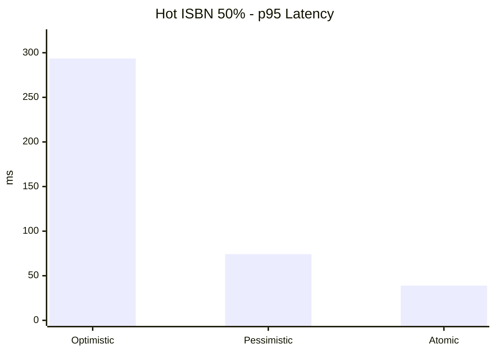
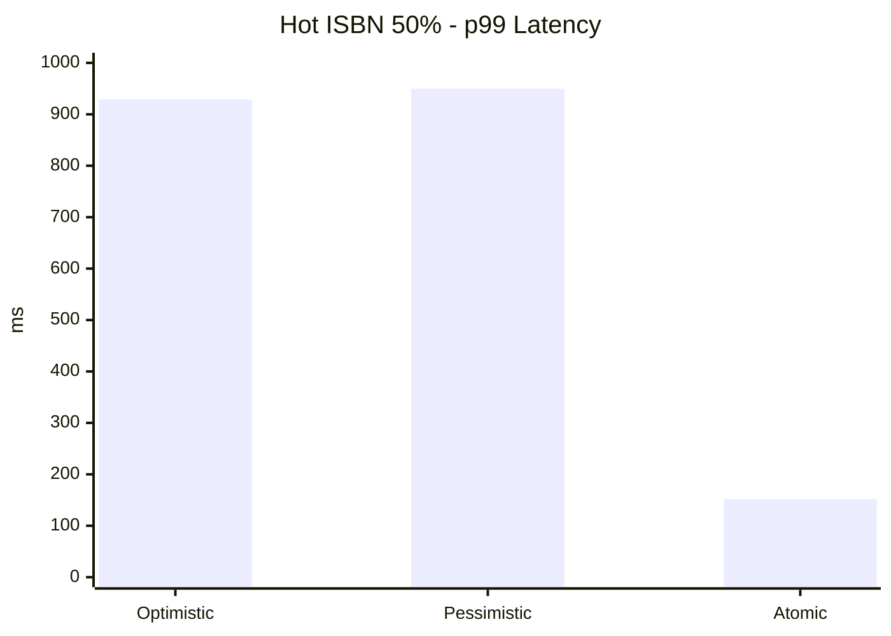
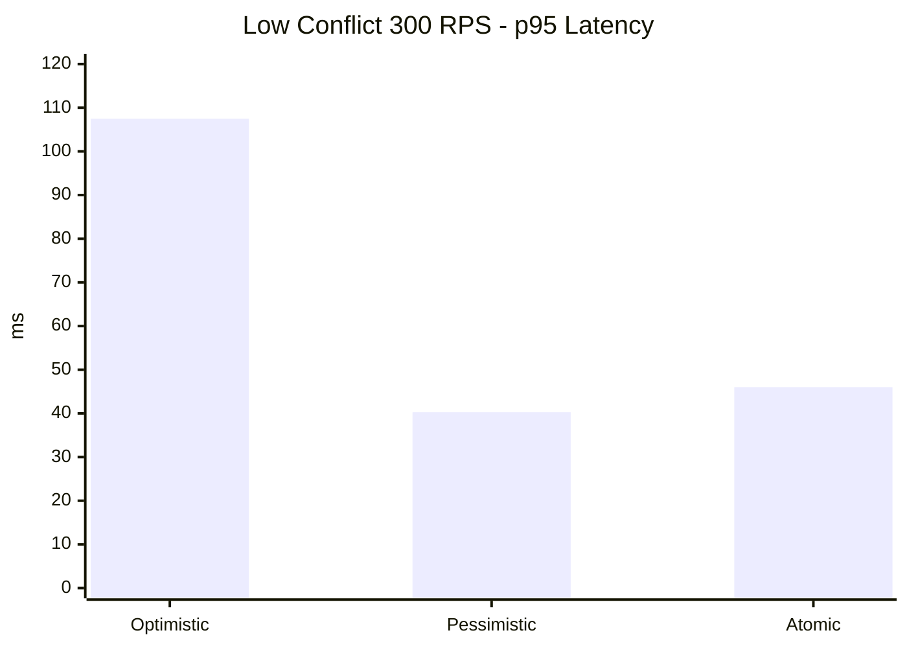

# 실 주문 API 기준 재고 차감 Atomic Update 성능 개선

## 1. 배경

도서 주문 서비스에서는 주문 생성 과정에서 재고 차감이 함께 수행된다. 이때 동일 ISBN에 주문이 집중되면 재고 수량 정합성을 보장하기 위해 동시성 제어가 필요하다.

처음에는 일반적인 JPA 락 전략인 낙관적 락과 비관적 락을 각각 적용해 비교했다. 하지만 실제 주문 API 기준으로 측정해보니, 두 방식 모두 주문 트랜잭션 관점에서 한계가 있었다.

이번 개선의 핵심은 낙관적 락의 version 충돌이 주문 생성 트랜잭션 전체 재시도로 확산되는 비용을 줄이는 것이다.

## 2. 문제

### 낙관적 락의 문제

낙관적 락은 충돌이 적을 때는 락 대기 없이 처리할 수 있다. 하지만 Hot ISBN에 주문이 집중되면 version 충돌이 발생하고, 이 충돌이 주문 API에서는 주문 전체 재시도로 이어진다.

즉, 재고 차감만 다시 시도하는 것이 아니라 주문 생성, 주문 상품 생성, 가격 계산, 배송 정책 조회 등 이미 수행한 작업이 롤백 후 다시 실행된다. 이 때문에 p95/p99 지연시간과 실패율이 크게 증가했다.

### 비관적 락의 문제

비관적 락은 충돌 상황에서 실패율을 낮출 수 있다. 하지만 `SELECT ... FOR UPDATE`로 재고 row를 선점하므로, 동일 ISBN에 요청이 몰리면 lock wait가 발생한다.

이번 측정에서는 평균과 p95는 안정적이었지만, Hot ISBN 집중 조건에서 p99가 크게 튀고 일부 dropped iteration이 발생했다. 즉, 실패는 줄였지만 tail latency와 락 대기 비용 문제가 남았다.

## 3. 개선 방향

낙관적 락과 비관적 락의 문제를 줄이기 위해 재고 차감을 조건부 Atomic Update 방식으로 전환했다.

```sql
update book_stock
set quantity = quantity - :quantity,
    version = version + 1
where isbn = :isbn
  and quantity >= :quantity
```

이 방식은 재고 row를 애플리케이션에서 조회한 뒤 version 충돌을 감지하는 경로를 줄이고, `SELECT ... FOR UPDATE`로 재고 row를 먼저 선점하는 경로도 제거한다. DB의 단일 UPDATE 문으로 "재고가 충분할 때만 차감" 조건을 처리하고, 반영된 row 수로 성공 여부를 판단한다.

다만 Atomic Update는 lock-free 방식이 아니다. UPDATE가 성공해 대상 row를 수정하면 DB는 해당 row에 exclusive lock을 획득하고, 현재 구조에서는 주문 트랜잭션이 commit/rollback 될 때까지 lock이 유지된다. 즉, 이번 개선은 lock 제거가 아니라 낙관적 락 충돌과 주문 전체 retry 비용을 줄이는 개선이다.

| 전략 | 처리 방식 | 주요 비용 |
| --- | --- | --- |
| Optimistic | 조회 후 version 비교 | 충돌 시 주문 전체 재시도 |
| Pessimistic | 조회 시 row lock 획득 | lock wait, tail latency |
| Atomic Update | 조건부 UPDATE 1회 | 재고 부족 시 affected row 확인 |

`affectedRows == 0`은 SQL만 보면 ISBN이 존재하지 않는 경우와 재고가 부족한 경우를 모두 포함할 수 있다. 현재 구현에서는 주문 대상 ISBN의 유효성을 분리하기 위해 UPDATE 전에 ISBN 존재 여부를 확인하고, 존재하지 않으면 `BookStockNotFoundException`, 존재하지만 차감 조건을 만족하지 못하면 `InsufficientStockException`으로 처리한다.

## 4. 실험 설계

기존 재고 차감 전용 API가 아니라 실제 주문 API인 `POST /api/orders`를 대상으로 측정했다.

| 항목 | 값 |
| --- | --- |
| API | `POST /api/orders` |
| 주문 유형 | Guest 주문 |
| 회원 헤더 | `X-User-Id` 미전달 |
| 쿠폰/포인트/포장 | 제외 |
| 주문 item | ISBN 1개, 수량 1개 |
| 비교 전략 | Optimistic, Pessimistic, Atomic Update |

### 시나리오 A: Hot ISBN 집중

| 항목 | 값 |
| --- | --- |
| 트래픽 | 220 RPS |
| 지속 시간 | 30초 |
| Hot ISBN 비중 | 50% |
| Hot ISBN 수 | 5개 |
| Cold ISBN 수 | 100개 |

### 시나리오 B: 저충돌 고트래픽

| 항목 | 값 |
| --- | --- |
| 트래픽 | 300 RPS |
| 지속 시간 | 30초 |
| ISBN 분산 | Cold ISBN 100개 |
| Hot ISBN 비중 | 0% |

## 5. 측정 결과

### 시나리오 A: Hot ISBN 50%, 220 RPS

| 전략 | 처리 RPS | 실패율 | 평균 응답 | p95 | p99 | dropped |
| --- | ---: | ---: | ---: | ---: | ---: | ---: |
| Optimistic | 217.363 | 0.712% | 48.10ms | 293.57ms | 928.79ms | 0 |
| Pessimistic | 213.954 | 0% | 43.18ms | 74.29ms | 949.75ms | 17 |
| Atomic Update | 219.900 | 0% | 15.81ms | 38.99ms | 151.83ms | 0 |

Hot ISBN만 분리하면 차이가 더 명확하다.

| 전략 | Hot 평균 응답 | Hot p95 | Hot p99 | Hot 실패율 |
| --- | ---: | ---: | ---: | ---: |
| Optimistic | 77.45ms | 410.71ms | 985.76ms | 1.434% |
| Pessimistic | 42.67ms | 79.96ms | 953.73ms | 0% |
| Atomic Update | 16.04ms | 42.19ms | 124.28ms | 0% |





### 시나리오 B: Low Conflict, 300 RPS

| 전략 | 처리 RPS | 실패율 | 평균 응답 | p95 | p99 | dropped |
| --- | ---: | ---: | ---: | ---: | ---: | ---: |
| Optimistic | 298.467 | 0% | 26.08ms | 107.49ms | 225.03ms | 0 |
| Pessimistic | 299.875 | 0% | 18.15ms | 40.26ms | 162.18ms | 0 |
| Atomic Update | 299.816 | 0% | 19.72ms | 46.01ms | 184.60ms | 0 |



## 6. 검증

Atomic Update 적용 후 다음 테스트로 정상 동작을 검증했다.

| 테스트 | 검증 내용 |
| --- | --- |
| 재고 충분 시 차감 | 10개 재고에서 3개 차감 시 최종 재고 7개 |
| 재고 부족 시 미차감 | 2개 재고에서 3개 차감 시 `InsufficientStockException`, 최종 재고 2개 |
| ISBN 없음 | 존재하지 않는 ISBN 차감 시 `BookStockNotFoundException` |
| 동시 차감 | 초기 재고 5개에 20개 스레드가 1개씩 차감 시도 시 성공 5건, 실패 15건, 최종 재고 0개 |
| 다중 ISBN 주문 rollback | 첫 번째 상품 차감 성공 후 두 번째 상품 재고 부족 발생 시 첫 번째 상품 재고 원복, 주문 row 미생성 |

테스트 실행 결과는 다음과 같다.

```text
AtomicUpdateStockDeductionStrategyTest: Tests run: 4, Failures: 0, Errors: 0, Skipped: 0
OrderProcessAtomicRollbackTest: Tests run: 1, Failures: 0, Errors: 0, Skipped: 0
```

## 7. 개선 효과

Hot ISBN 집중 상황에서 Atomic Update는 낙관적 락의 주문 전체 retry 비용과 비관적 락의 lock wait tail을 모두 줄였다.

| 비교 | 개선 결과 |
| --- | --- |
| Optimistic 대비 p95 | 293.57ms -> 38.99ms, 약 86.7% 감소 |
| Optimistic 대비 p99 | 928.79ms -> 151.83ms, 약 83.7% 감소 |
| Optimistic 대비 실패율 | 0.712% -> 0% |
| Optimistic 대비 Hot p95 | 410.71ms -> 42.19ms, 약 89.7% 감소 |
| Pessimistic 대비 p95 | 74.29ms -> 38.99ms, 약 47.5% 감소 |
| Pessimistic 대비 p99 | 949.75ms -> 151.83ms, 약 84.0% 감소 |
| Pessimistic 대비 dropped | 17 -> 0 |

저충돌 고트래픽 상황에서도 Atomic Update는 실패율 0%를 유지했고, Optimistic 대비 p95를 약 57.2% 줄였다. Pessimistic-only가 이 조건에서는 가장 낮은 p95를 보였지만, Atomic Update도 근접한 수준을 유지했다.

## 8. 결과

이번 개선의 핵심은 단순히 락 종류를 바꾼 것이 아니라, 재고 차감의 동시성 제어 방식을 주문 전체 재시도에 덜 민감한 구조로 바꾼 것이다.

낙관적 락은 충돌 발생 시 주문 전체 재시도로 tail latency와 실패율이 증가했다. 비관적 락은 실패율을 낮췄지만 Hot ISBN 집중 상황에서 lock wait로 p99가 크게 튀었다.

Atomic Update 방식은 재고 차감을 단일 조건부 UPDATE로 처리해 낙관적 락의 version 충돌 예외와 주문 전체 retry 비용을 줄였다. 또한 `SELECT ... FOR UPDATE`로 재고 row를 먼저 조회해 잠그는 경로를 제거했다. 그 결과 Hot ISBN 50%, 220 RPS 조건에서 Optimistic 대비 p95 latency를 86.7%, p99 latency를 83.7% 줄였고, 실패율을 0%로 낮췄다.

> 실제 주문 API 기준으로 재고 동시성 제어 전략을 비교하고, Hot ISBN 집중 상황에서 낙관적 락의 version 충돌이 주문 생성 트랜잭션 전체 retry로 확산되는 문제를 확인했다. 이후 재고 차감을 조건부 Atomic Update 방식으로 전환해 재고 확인과 차감을 단일 SQL로 처리했고, Optimistic Lock 대비 p95 latency 86.7%, p99 latency 83.7% 개선과 실패율 0%를 달성했다. 다만 Atomic Update 역시 UPDATE 대상 row에 lock을 획득하며, 현재 구조에서는 주문 트랜잭션 commit/rollback까지 lock이 유지된다. 따라서 이번 개선은 lock 제거가 아니라 낙관적 락 충돌과 주문 전체 retry 비용을 줄인 개선이며, lock 보유 시간 최적화는 이후 재고 예약 구조나 트랜잭션 분리를 통해 개선할 계획이다.

## 9. 구현 포인트

| 파일 | 역할 |
| --- | --- |
| `BookStockRepository` | `quantity >= 요청 수량` 조건을 포함한 원자 UPDATE 쿼리 정의 |
| `AtomicUpdateStockDeductionStrategy` | ISBN 존재 여부 확인 후 affected row 수로 차감 성공/재고 부족 판단 |
| `StockDeductionStrategyResolver` | 설정값에 따라 Optimistic, Pessimistic, Atomic 전략 선택 |
| `OrderProcessService` | 주문 전체 처리 경계에서 retry와 처리 시간 계측 |
| `perf/order-create.js` | 실제 주문 API 기준 k6 부하 테스트 |

## 10. 한계와 후속 개선

Atomic Update는 재고 수량 차감처럼 단일 row의 조건부 변경에는 효과적이다. 다만 UPDATE 대상 row lock은 여전히 트랜잭션 종료까지 유지된다. 현재 구조에서는 주문 생성 트랜잭션 안에서 재고 차감 이후 가격 계산, 할인 처리, 주문 저장, 포인트 처리, 주문 이벤트 전송이 이어지므로 재고 row lock 보유 시간이 주문 트랜잭션 길이에 영향을 받는다.

또한 다중 ISBN 주문에서 일부 상품 차감 후 다른 상품 재고 부족이 발생하면 주문 트랜잭션이 rollback되어 앞서 차감된 재고도 원복되는 것을 테스트로 확인했다. 다만 결제/쿠폰/포인트까지 포함한 실제 주문 흐름에서는 보상 트랜잭션과 상태 전이를 함께 검토해야 한다.

후속 개선으로는 재고 예약 테이블 분리, 재고 차감 트랜잭션 분리, Redis 기반 선점 큐, ISBN별 Hot 여부 동적 판정, 결제 실패 시 재고 보상 트랜잭션 설계를 검토할 수 있다.
